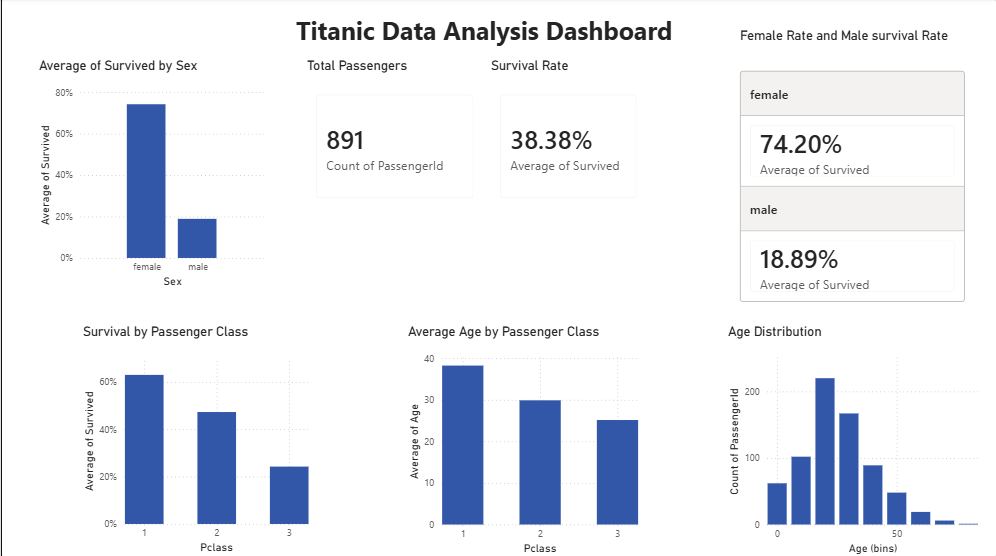

# Titanic Data Analysis Dashboard (Power BI)

## Project Overview
This project uses Microsoft Power BI to build an interactive dashboard 
analyzing the Titanic dataset, comparing survival patterns across gender, 
class, and age.

## Dashboard

## Key Findings
- Overall survival rate: 38%
- Female survival rate: 74%, Male survival rate: 19%
- 1st class had the highest survival rate, declining through 2nd and 3rd class
- Age distribution shows most passengers were between 20-40 years old

## Skills Used
- Power BI Desktop
- Data Visualization
- Dashboard Design
- DAX (basic measures)

## Dataset
Kaggle Titanic Dataset (891 passengers)
